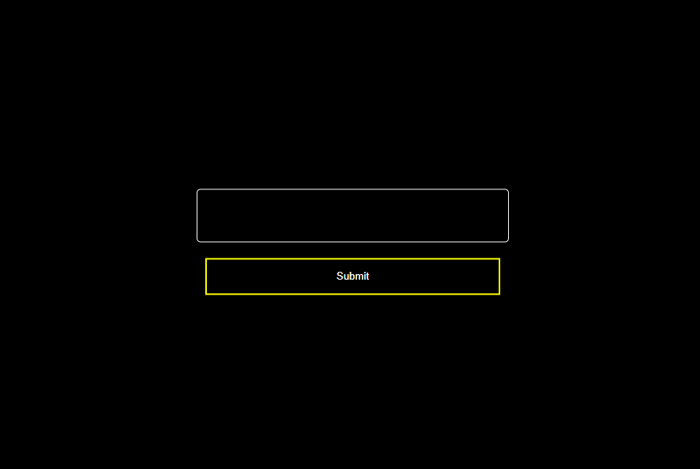

<h1 align="center"><strong><i>KB TOOL</i></strong></h1>

---

[![Issues][issues-shield]][issues-url]

### Branches

- [x] [stable] - Stable branch (complete with start.sh)
- [x] [API] - API branch 
- [x] [APP] - Frontend branch

### Purpose

It is a RTU school project where we want to be able to build a research tool for names.
The goal is to get the most relevant name for a given search in database.

### How to run

- Clone the repository
- Install dependencies with `npm install`
- Run the script: `start.sh` in the root folder or you can start API and APP separately
using `npm start` in the API and APP folders respectively.
- Open your browser and go to `localhost:3000` to see the app running. You can also create a `.env` file in the API folder and add a **PORT** variable to change the port.

### Dependencies problems
- If you have problems with dependencies, try to update using `ncu -u` and then `npm install`
- Try to delete the `package-lock.json` file and then `npm install`

### Acknowledgement

> Supervised by **Prof. Aleksejs Jurenoks** (Professor at RTU)
> Project Link: [https://github.com/PhantHive/KB_tool](https://github.com/PhantHive/KB_tool/)

<!-- MARKDOWN LINKS & IMAGES -->
[issues-shield]: https://img.shields.io/github/issues/PhantHive/KB_tool.svg?style=for-the-badge&logo=github
[issues-url]: https://github.com/PhantHive/KB_tool/issues/